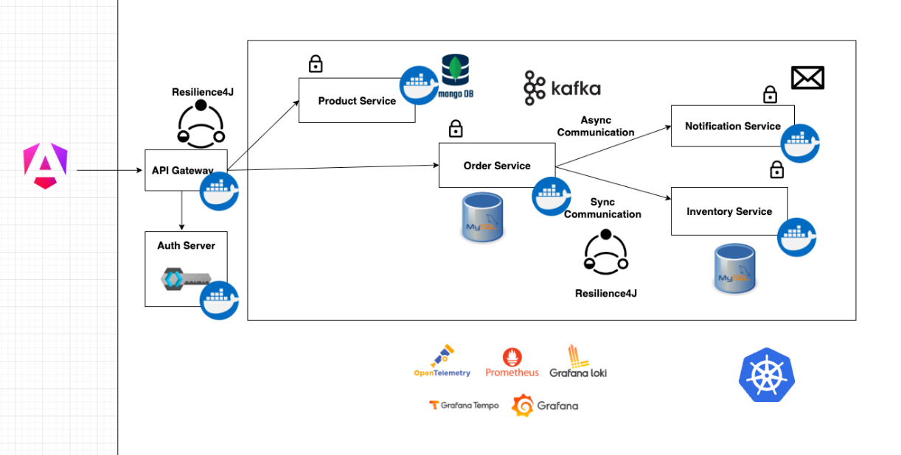

# spring-boot-microservices-project

[Spring Boot Microservices Course Project](https://www.youtube.com/playlist?list=PLSVW22jAG8pBnhAdq9S8BpLnZ0_jVBj0c)
from [Programming Techie](https://www.youtube.com/@ProgrammingTechie) YouTube Channel.

The project is structured under the following diagram:

## Pre-requisites
- Java 21+
- Docker 29.x+

## Technologies Used
- mySQL (8.3.0)
- mongoDB (7.0.5)
- Testcontainers (Testing)
- WireMock (Testing)
- Flyway (Database Migrations)
- RestAssured (API Testing)
- RestClient (HTTP Client)
- Spring Cloud Gateway (API Gateway)
- Keycloak (Authentication Server)
- OpenAPI/Swagger (API Documentation)

# 🚧🚧🚧
## Project Status: In Progress...
# 🚧🚧🚧